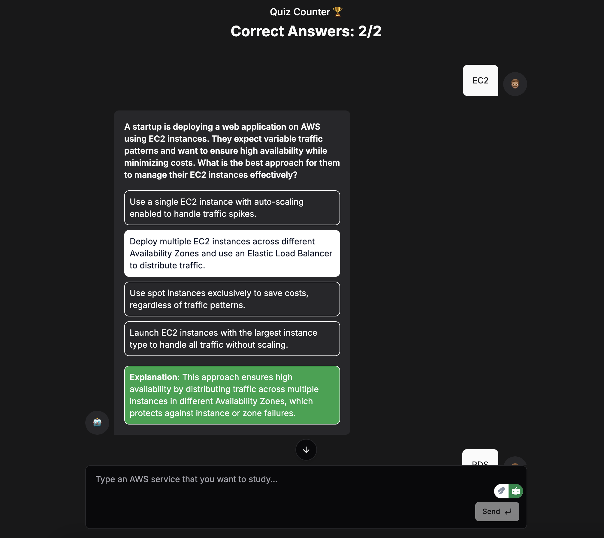

# AWS Certified Solutions Architect - Associate Exam Study Bot

This project is a web-based chatbot application designed to help users study for the **AWS Certified Solutions Architect - Associate (SAA-C03)** exam. The chatbot leverages AI to generate realistic, scenario-based multiple-choice questions to enhance exam preparation.

## Features

- **Topic-based Question Generation:** Users can input a topic to study (one question/topic at a time), and the bot generates a multiple-choice question with four options, including one correct answer.
- **Technologies Used:**
  - [Next.js](https://nextjs.org/): React framework for server-rendered and static web applications.
  - [Tailwind CSS](https://tailwindcss.com/): Utility-first CSS framework for designing responsive and modern UI.
  - [shadcn/ui](https://shadcn.dev/): Pre-built, customizable UI components for React applications.
  - [OpenAI](https://openai.com/): AI-powered question generation and natural language understanding.
  - **TypeScript:** Static typing for JavaScript to ensure code reliability.

## Getting Started

### Prerequisites

- **Node.js** (v20 or higher recommended)
- **npm** or **yarn**

### Installation

1. Clone the repository:

   ```bash
   git clone <repository-url>
   ```

2. Navigate to the project directory:

   ```bash
   cd aws-study-bot
   ```

3. Install dependencies:

   ```bash
   npm install or yarn install
   ```

### Configuration

1. Create a `.env.local` file in the root directory.
2. Add the following environment variables:

   ```env
   OPENAI_API_KEY=<your-openai-api-key>
   ```

   Replace `<your-openai-api-key>` with your OpenAI API key.

### Running the Application

To start the development server, run:

```bash
npm run dev or yarn dev
```

Open [http://localhost:3000](http://localhost:3000) in your browser to view the application.

### Build for Production

To build the application for production, run:

```bash
npm run build or yarn build
```

To serve the production build locally, run:

```bash
npm start or yarn start
```

## How It Works

1. The user types a topic they want to study (e.g., "EC2 scaling strategies").
2. The bot generates a scenario-based question related to the input topic.
3. The question is displayed with four answer options, one of which is correct.
4. The user selects an answer, and the bot provides immediate feedback with an explanation.
5. The user can check his score based on how many questions he answered.

## Screenshots



## Future Enhancements

- Support for multiple questions/topics in a single session.
- Progress tracking.
- Option to filter questions by AWS service or domain (e.g., Compute, Networking, Storage).
- Integration with user authentication for personalized learning.

## Contributing

Contributions are welcome! Please follow these steps:

1. Fork the repository.
2. Create a feature branch (`git checkout -b feature/new-feature`).
3. Commit your changes (`git commit -m "Add new feature"`).
4. Push to the branch (`git push origin feature/new-feature`).
5. Open a pull request.

## License

This project is licensed under the MIT License.

---

Happy studying! 🚀
